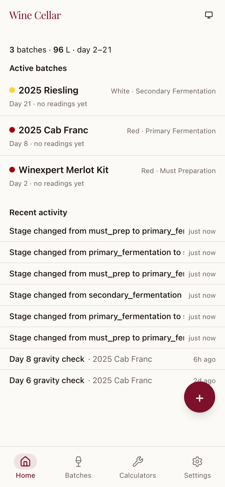
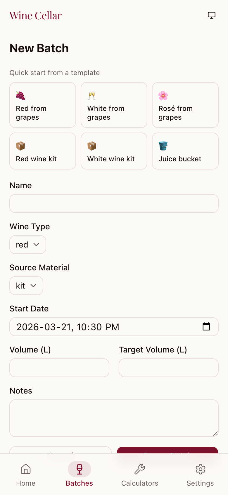
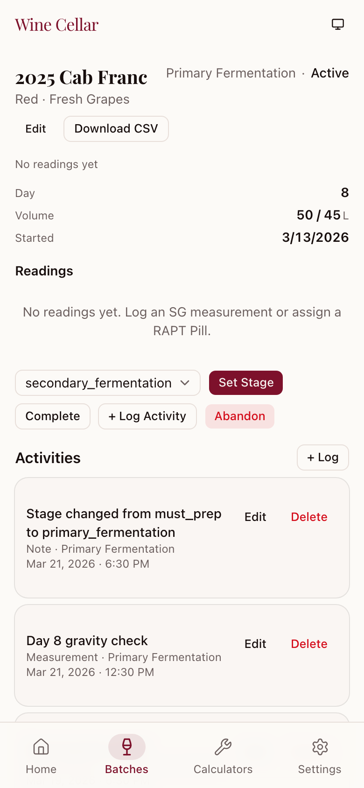
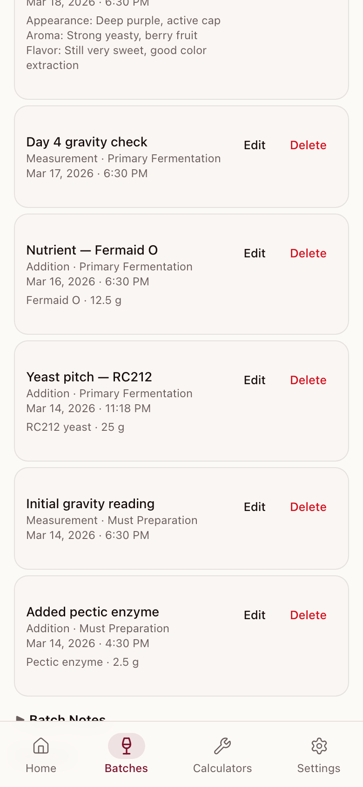
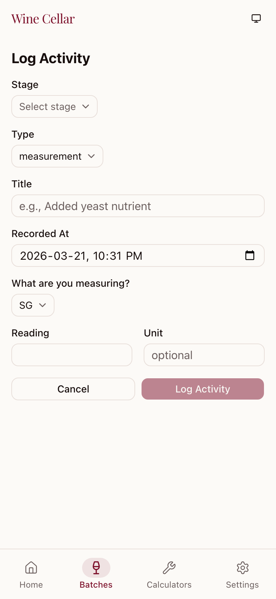
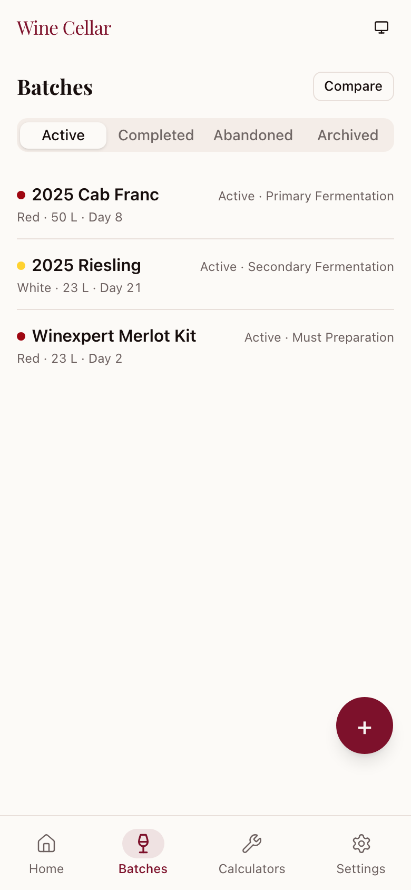
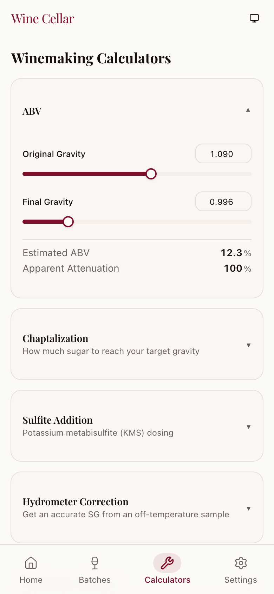
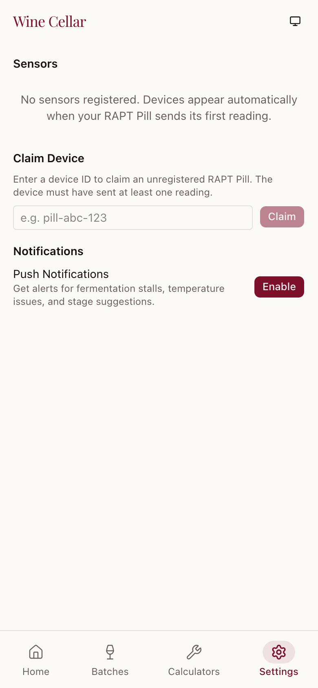

# Wine Cellar user guide

Wine Cellar helps you keep track of your wine from crush day to bottling day. Log what you do, watch fermentation progress, and get a heads-up when something needs your attention.

## Getting started

### Signing in

Open Wine Cellar in your mobile browser. The login screen offers two ways to sign in:

- **Sign in with GitHub**: uses your GitHub account via OAuth. This is the default option for new users.
- **Sign in with Passkey**: uses Face ID, Touch ID, or another device passkey for quick access. You can set this up during onboarding or later from Settings.

If the site has closed registrations, the login screen shows a message that it does not accept new signups.

### Welcome and onboarding

The first time you sign in, a welcome page guides you through two quick setup steps:

1. **Display name**: enter the name you want shown in the app. This is optional; you can change it later.
2. **Passkey setup**: add a passkey for Face ID or Touch ID sign-in. This is also optional; you can do it later from Settings.

Tap **Continue to dashboard** to finish onboarding and start using Wine Cellar.

### Navigating the app

You can add Wine Cellar to your home screen for a native app experience — it works as a progressive web app (PWA).

The bottom navigation bar gives you access to four main sections:

- **Home** — Dashboard overview of all active fermentations
- **Batches** — Browse and manage all batches by status
- **Calculators** — Winemaking reference tools
- **Settings** — Device management and push notifications

## Dashboard

The home screen gives you an at-a-glance view of your active fermentations.



At the top, summary stats show your total active batches, combined volume, and range of fermentation days.

**Active batches** are listed below, sorted with the batches that need the most attention first — stalled fermentations appear before healthy ones. Each batch row shows:

- Batch name with a colour indicator for wine type (red, white, rose, etc.)
- Current stage and wine type
- Day count and time since last reading

If any batches have alerts (stalled fermentation, temperature issues, missing readings), they appear in a "Needs attention" section at the top. Tap an alert to go directly to that batch, or dismiss it with the X button.

**Recent activity** at the bottom shows the last few activities logged across all batches.

Tap **+** to start tracking a new batch.

## Starting a new batch

Tap **+** on the Home or Batches screen to get started.



**Templates** at the top let you quick-start common setups:

- Red/white/rose from grapes (50 L batches)
- Red/white wine kits (23 L)
- Juice bucket (23 L)

Tapping a template pre-fills the form. You can then adjust any field:

- **Name** — A descriptive name (e.g., "2025 Cab Franc")
- **Wine type** — Red, white, rose, orange, sparkling, or dessert
- **Source material** — Kit, juice bucket, or fresh grapes
- **Start date** — Defaults to now; backdate if needed
- **Volume / Target volume** — Current and expected final volume in litres
- **Notes** — Free-form notes about the batch

Tap **Create Batch** to save. You'll be taken to the batch detail page.

## Working with a batch

The batch detail page is your command centre for a single batch.



### Snapshot

The top section shows key fermentation metrics at a glance:

- Current specific gravity (SG) and its source (device or manual)
- Temperature
- Estimated ABV and attenuation percentage
- Gravity velocity (points per day over the last 48 hours)
- Days fermenting, volume, and start date

If a RAPT Pill hydrometer is assigned, readings appear automatically. Otherwise, log an SG measurement — only SG readings show up on the fermentation chart. Other metrics (pH, TA, SO2, Brix) are saved in your activity log but don't appear on the chart.

### Timeline and current phase

The **Timeline** card shows where your batch stands and how far along you are.

At the top, a **current phase indicator** highlights the stage your wine is in now (for example, "Primary Fermentation"). A badge shows how many days have elapsed. During primary fermentation, a progress bar tracks your position against the estimated total duration (for example, "Day 4 of ~14").

Below the current phase, a vertical timeline lists **upcoming milestones** with relative dates such as "in six days" or "in about two months." Completed milestones appear dimmed, showing a checkmark and the date they occurred.

Wine Cellar projects these milestones from your batch's start date and typical winemaking timelines, so they shift as your batch progresses. Stage suggestions also appear in this context: when Wine Cellar detects that your readings point to a stage change, the timeline reflects that.

### Readings chart

Below the snapshot, a dual-axis chart shows gravity and temperature over time. Toggle between 7-day, 14-day, and all-time views. Activity markers appear as vertical lines on the chart so you can correlate additions and rackings with gravity changes.

### What you can do

Active batches have controls to:

- **Set Stage** — Advance through waypoint stages (must preparation, primary fermentation, secondary fermentation, stabilization, bottling)
- **Complete** — Mark the batch as finished
- **Abandon** — Cancel the batch
- **+ Log Activity** — Record a new activity

Completed or abandoned batches can be **reopened** to resume tracking. Completed batches can also be **archived** to remove them from the active view. You can also **edit** a batch's name, volume, target volume, and notes by tapping **Edit** on the detail page.

### Activity history



Everything you've logged appears in reverse chronological order — what you did, when you did it, and all the details (chemical amounts, tasting notes, gravity readings, etc.). You can edit or delete any entry.

### Getting your data out

Tap **Download CSV** to save your batch data as spreadsheet-ready files:

- Readings (timestamp, gravity, temperature, source)
- Activities (timestamp, type, stage, title, details)

## Recording what you did

Tap **+ Log Activity** from a batch's detail page to record what you've done.



Choose from six activity types, each with its own detail fields:

| Type | Detail fields |
|------|--------------|
| Addition | Chemical name, amount, unit |
| Measurement | Metric (SG, pH, SO2, etc.), reading, unit |
| Racking | From vessel, to vessel |
| Tasting | Aroma, flavour, appearance |
| Adjustment | Parameter, before value, after value, unit |
| Note | Free-form text |

The **stage** dropdown only shows stages allowed by your batch's current waypoint — for example, a batch in primary fermentation allows "Primary fermentation" and "Pressing." Backdate the **Recorded At** timestamp if you're logging something after the fact.

## Finding your batches



The Batches tab shows all your batches, filtered by where they stand:

- **Active** — Currently fermenting
- **Completed** — Finished fermentations
- **Abandoned** — Cancelled batches
- **Archived** — Completed batches moved out of the active view

Each batch card shows the name, wine type, volume, days fermenting, and current stage. Tap any batch to open its detail page.

Use the **Compare** button (top right) to overlay fermentation curves from multiple batches side by side.

## Comparing batches

Pick up to five batches and overlay their gravity curves on a single chart. Below the chart, a stats table shows OG, current SG, ABV, attenuation, velocity, and days fermenting for each one.

This is great for seeing how this year's fermentation stacks up against last year's, or spotting why one batch is lagging behind another. Archived batches don't appear here — unarchive them first if you need to compare.

## Winemaking calculators



Five built-in tools so you don't have to reach for a spreadsheet:

- **ABV** — Calculate alcohol by volume from original and final gravity
- **Chaptalization** — Determine how much sugar to add to reach a target gravity
- **Sulfite addition** — Calculate potassium metabisulfite (KMS) dosing based on pH and target free SO2
- **Hydrometer correction** — Correct a gravity reading taken at a non-standard temperature
- **Calibration solution** — Generate instructions for making a reference sugar solution

Each calculator updates results in real time as you adjust the inputs.

## Settings



### Connecting a wireless hydrometer

If you use a RAPT Pill, you need to claim it before it shows up. Enter the device ID in the **Claim Device** section — the device must have sent at least one reading first. Once claimed, you can:

- **Assign** a device to an active batch to receive automatic gravity and temperature readings (assigning also backfills any prior unassigned readings)
- **Unassign** a device when moving it to a different batch

Each device card shows its latest readings, battery level, and signal strength. Completing or abandoning a batch automatically unassigns any attached device.

### Staying in the loop

Enable push notifications to get alerts on your phone or desktop when:

- Fermentation stalls (no gravity change for 48+ hours)
- No device readings are received for 48+ hours (only for batches with an assigned device)
- Temperature exceeds 30 C or drops below 8 C
- A stage change is suggested (e.g., gravity drops below 1.020 with slowing velocity after primary)

Tap **Enable** and allow notifications when prompted. You can send a **test notification** to verify it works.

Stage suggestion notifications include quick action buttons — tap "Advance Now" to move to the next stage directly from the notification.

## How a batch moves through the process

Batches progress through five stages:

1. **Must preparation** — Crushing, enzyme additions, initial measurements
2. **Primary fermentation** — Active fermentation after yeast pitch
3. **Secondary fermentation** — Slower fermentation after racking off lees
4. **Stabilization** — Fining, sulfite additions, cold stabilization
5. **Bottling** — Final preparation and bottling

Within each stage, you can log activities at more specific steps (pressing, malolactic fermentation, bulk aging, filtering, etc.).

Move between stages using the **Set Stage** dropdown on the batch detail page. Wine Cellar may also suggest a stage change when your gravity readings indicate you're ready.

### What happens to a batch over time

```
Active --> Completed --> Archived
  |            |             |
  v            v             v
Abandoned   Reopened     Unarchived
              ^               |
              |               v
              +---------- Completed
```

- **Active** batches are your in-progress fermentations
- **Completed** batches are finished — archive them to declutter your dashboard
- **Abandoned** batches were cancelled before completion
- Completed and abandoned batches can be **reopened** to resume tracking
- Archived batches can be **unarchived** back to completed status
- Abandoned batches can be permanently **deleted**

## Tips

- **Install as a PWA**: Add Wine Cellar to your home screen from your browser's share menu for quick access and push notifications.
- **Backdate activities**: Forgot to log something yesterday? Set the "Recorded At" field to the correct time when creating an activity.
- **Use templates**: The new batch templates save time for common setups. Adjust the pre-filled values as needed.
- **Export early**: Download CSV exports periodically as a backup of your fermentation data.
- **Compare batches**: Use the comparison view to learn from past batches and spot trends across vintages.
